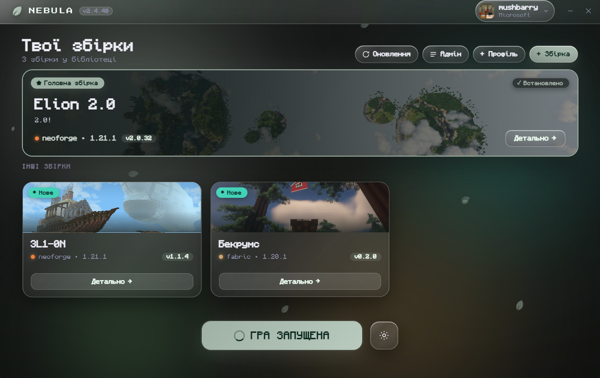
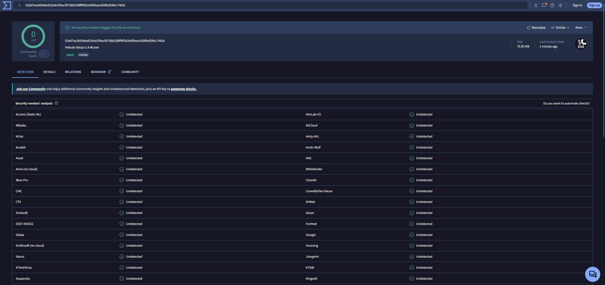

# Nebula Launcher

A custom Electron launcher for Minecraft modpacks in the **Modrinth `.mrpack`** format.
Packs are pulled **automatically** from a built-in repository, so anyone who opens the
launcher sees them right away and installs them in one click.

> **Note — who this is for**
>
> Nebula was built **primarily for the [3adrypanka](https://moments.zadrypanka.xyz) Discord
> community**, and it ships pointing at that server's modpack repository by default.
>
> It is open source, so anyone else is welcome to use it: you can **edit or remove the
> bundled packs and point the launcher at your own source** (see
> [Using your own repository](#using-your-own-repository)). No part of it is tied to
> 3adrypanka beyond the default repository URL.



## ⚠️ "Windows protected your PC" (SmartScreen) — це не вірус / it is not a virus

**🇺🇦 Українською.** Під час першого запуску Windows може показати синє вікно
**«Система Windows захистила ваш ПК»** (SmartScreen), а антивірус — попередити про
«невідомого видавця». **Це не означає, що у програмі є вірус.** Так Windows реагує на
будь-яку програму **без платного цифрового підпису** (~сотні $ на рік) та без напрацьованої
«репутації» за кількістю завантажень. Nebula — відкритий код (можеш перевірити весь код у
цьому репозиторії), збірки роблять автоматично на GitHub.

Щоб запустити: натисни **«Детальніше» → «Виконати попри все»**.

**🇬🇧 In English.** On first launch Windows may show a blue
**"Windows protected your PC"** (SmartScreen) dialog, and some antivirus may warn about an
"unknown publisher". **This does not mean the file contains a virus.** Windows shows this for
any app that isn't **code-signed** (a paid certificate, ~hundreds $/year) and hasn't built up
download "reputation" yet. Nebula is fully open source (read all the code in this repo) and
its builds are produced automatically by GitHub Actions.

To run it: click **"More info" → "Run anyway"**.

**✅ Proof / Доказ — незалежна перевірка на [VirusTotal](https://www.virustotal.com/gui/file/528d7ea3059ebd52bdcf39acf97588338fff4f263d6f9eac050fbd59fe17403c/detection): 0 / 67**
(жоден з 67 антивірусів не вважає файл шкідливим / none of 67 vendors flagged the file).

[](https://www.virustotal.com/gui/file/528d7ea3059ebd52bdcf39acf97588338fff4f263d6f9eac050fbd59fe17403c/detection)

## Features

- **Automatic pack catalog** — the built-in repository is fetched on startup; available
  packs appear on the home screen. Click a card to select it, **Детально / Details** for
  the full page (media, description, changelog, mods).
- **Two ways to sign in**
  - **Microsoft / Xbox** (msmc) — licensed account, online servers, real skin head shown.
  - **Offline** — just pick a nickname (offline-UUID, as on `online-mode=false` servers).
  - Sessions persist between launches; multiple accounts can be saved and switched.
- **Incremental pack updates** — existing files are verified (sha1 for downloads, crc32 for
  overrides) and only missing/changed files are fetched. Files dropped from a pack are
  removed; **mods you added yourself are kept**.
- **Fast downloads** — parallel file downloads, multi-connection (segmented) transfer for
  large archives, and keep-alive connections.
- **Auto-Java** — the required JRE (8/17/21…) is detected from the MC version and fetched
  from Adoptium (Temurin).
- **All loaders** — Vanilla, Fabric, Quilt, Forge, NeoForge.
  - Fabric/Quilt/Vanilla via `minecraft-launcher-core`.
  - Forge/NeoForge via the official installer (`@xmcl`), processors run automatically.
- **Mod manager** — search Modrinth, install (with dependencies), enable/disable, remove.
- **Custom profiles** — create a plain Vanilla/Fabric/Quilt/NeoForge instance and add mods.
- **Discord Rich Presence** — shows *Playing Nebula* plus the pack name. No setup needed.
- **Theming** — customizable background/accent colours with presets, plus an optional
  **Liquid Glass** mode (frosted panels; off by default, easier on weak PCs).
- **Self-update** — the launcher updates itself from GitHub Releases.

## Running from source

```bash
npm install
npm start          # or: npm run dev  (with DevTools)
```

## Building the installer

```bash
npm run dist       # output in release/
```

Releases are normally built by CI: push a tag (`v2.4.1`) and the
[workflow](.github/workflows/build.yml) builds the Windows installer and attaches it to a
GitHub Release. The launcher's auto-updater reads that release feed.

## Using your own repository

The launcher ships with a built-in manifest URL:

```js
// src/main/repo.js
const BUILTIN_REPOS = [
  'https://moments.zadrypanka.xyz/launcher/packs.json'
];
```

Replace it with your own `packs.json` (or remove it entirely and let users add sources
themselves via **Add pack → Repository**). The manifest is a plain JSON list of packs:

```json
{
  "packs": [
    {
      "id": "my-pack",
      "name": "My Pack",
      "version": "1.0",
      "gameVersion": "1.21.1",
      "loader": "neoforge",
      "mrpack": "https://example.com/files/my-pack.mrpack",
      "summary": "Short one-line description",
      "description": "Full description for the Overview tab",
      "icon": "https://example.com/icon.png",
      "media": ["https://youtu.be/…", "https://i.imgur.com/….png"],
      "changelog": "## 1.0\n- first release"
    }
  ]
}
```

Bumping a pack's `version` in the manifest is what triggers the update badge for users.

Users can also add packs without any repository at all — **Add pack** accepts a direct
`.mrpack` URL or a local file.

## Optional: hosted admin API

The 3adrypanka deployment serves packs from its own site and exposes a small CRUD API so
packs can be managed from inside the launcher (Settings → Admin API + token → an **Admin**
button appears). This is entirely optional — the launcher works fine against any static
`packs.json`.

- `GET /launcher/packs.json` — public manifest.
- `GET /launcher/admin/verify` — token check.
- `POST /launcher/admin/packs` — create/update a pack (upsert by `id`).
- `DELETE /launcher/admin/packs/:id` — delete.

Admin routes are protected by `Authorization: Bearer <LAUNCHER_ADMIN_TOKEN>`. The token is
stored only in the user's local config — it is never bundled into the app.

## Data layout

Everything lives under `%APPDATA%/Nebula/`:

```
config.json          # accounts, settings, installed packs
data/
  shared/            # versions, libraries, assets (shared between packs)
  instances/<id>/    # mods, config, saves for each pack
  java/<major>/      # auto-installed JREs
```

## Notes / limitations

- **Forge/NeoForge**: the first install runs the official installer (processors) — this can
  take a few minutes and needs internet and Java (installed automatically).
- NeoForge for MC 1.20.1 uses the older `forge` naming — handled automatically.
- The Windows build is **not code-signed**, so SmartScreen may warn about an unknown
  publisher on first run.

## Stack

Electron, minecraft-launcher-core (Fabric/Quilt/Vanilla), @xmcl/core + @xmcl/installer
(Forge/NeoForge), msmc (Microsoft auth), @xmcl/unzip, adm-zip, Node native http/crypto.

## Privacy

**Nebula does not collect, track or transmit any personal data to its developer.** There is
no telemetry, no analytics and no crash reporting. Your account, settings and installed
packs are stored **only on your own machine**, under `%APPDATA%/Nebula/config.json`.
Microsoft login tokens never leave your device — they are used solely to authenticate you
with Mojang/Microsoft when launching the game.

The launcher will not transfer any information to other networked systems unless
specifically requested by the user or the person installing or operating it. To perform the
actions you ask for, it contacts:

| Service | When | What is sent |
|---|---|---|
| Microsoft / Xbox / Mojang | You choose "Sign in with Microsoft", or launch the game | OAuth login (handled by Microsoft's own window) and your session token |
| Adoptium (Temurin) | A pack needs a Java runtime you don't have | A plain download request |
| Modrinth | You search for or install mods | Your search query and the mod id |
| Modpack repository | On startup and when installing/updating a pack | A request for `packs.json` and the `.mrpack` file. As with any web server, the host sees your IP address |
| mc-heads.net (fallback: crafatar.com) | You are signed in with a licensed account | Your Minecraft UUID, to render your skin head |
| GitHub | Update checks | A request for the latest release info |
| Discord | Discord is running | The pack name, sent to your **local** Discord client so it can show your status. Disabled if Discord is closed |
| YouTube / image hosts | You open the "Media" tab of a pack that has media | A standard embed request |

Nothing above is initiated on the developer's behalf — each request exists only to install,
update or launch what you asked for.

## License

[MIT](LICENSE) © mushbarry
